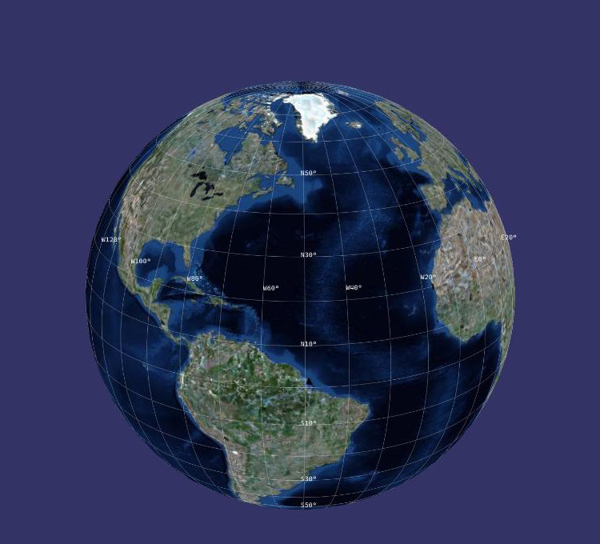
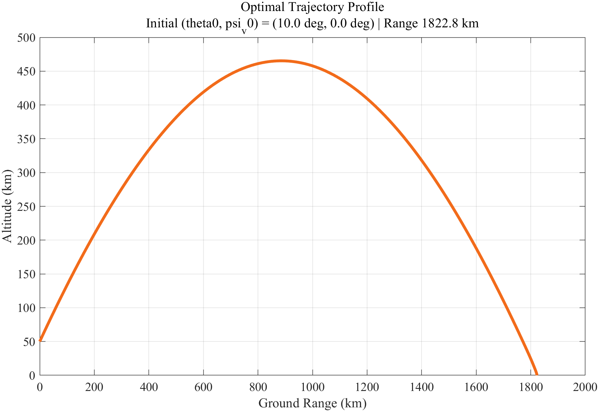
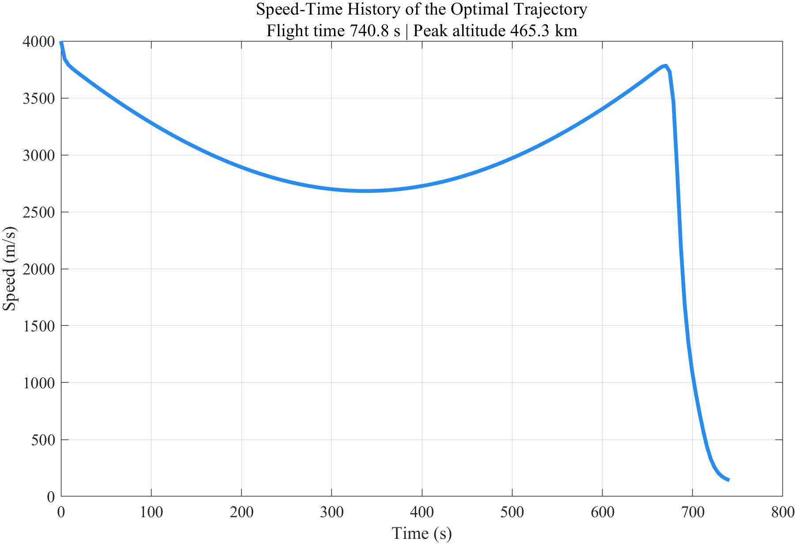
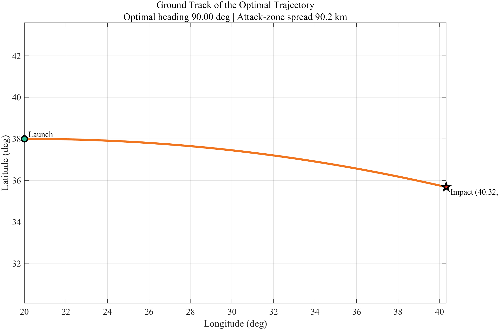
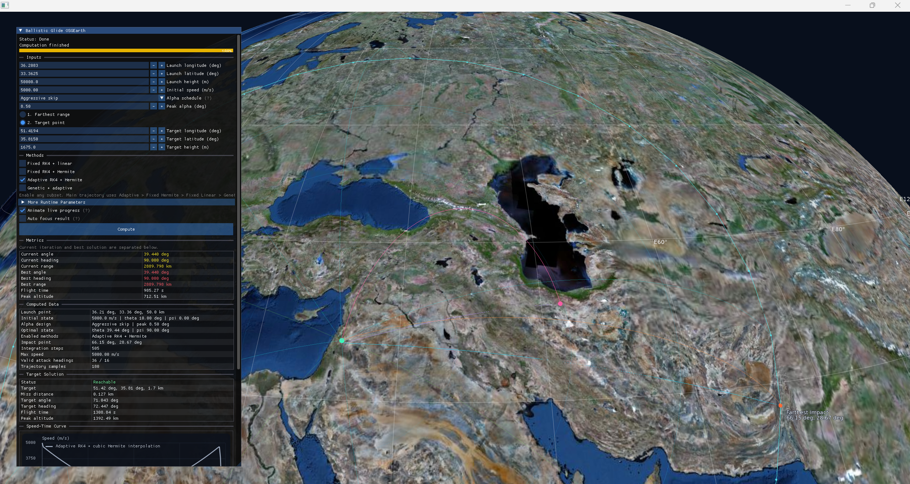
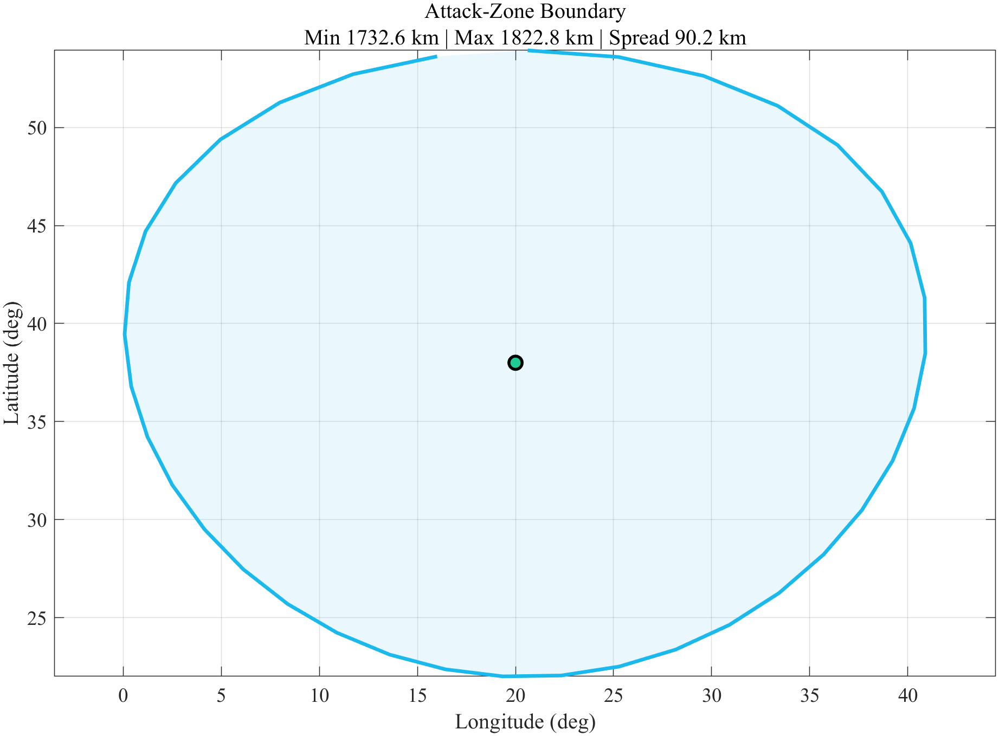
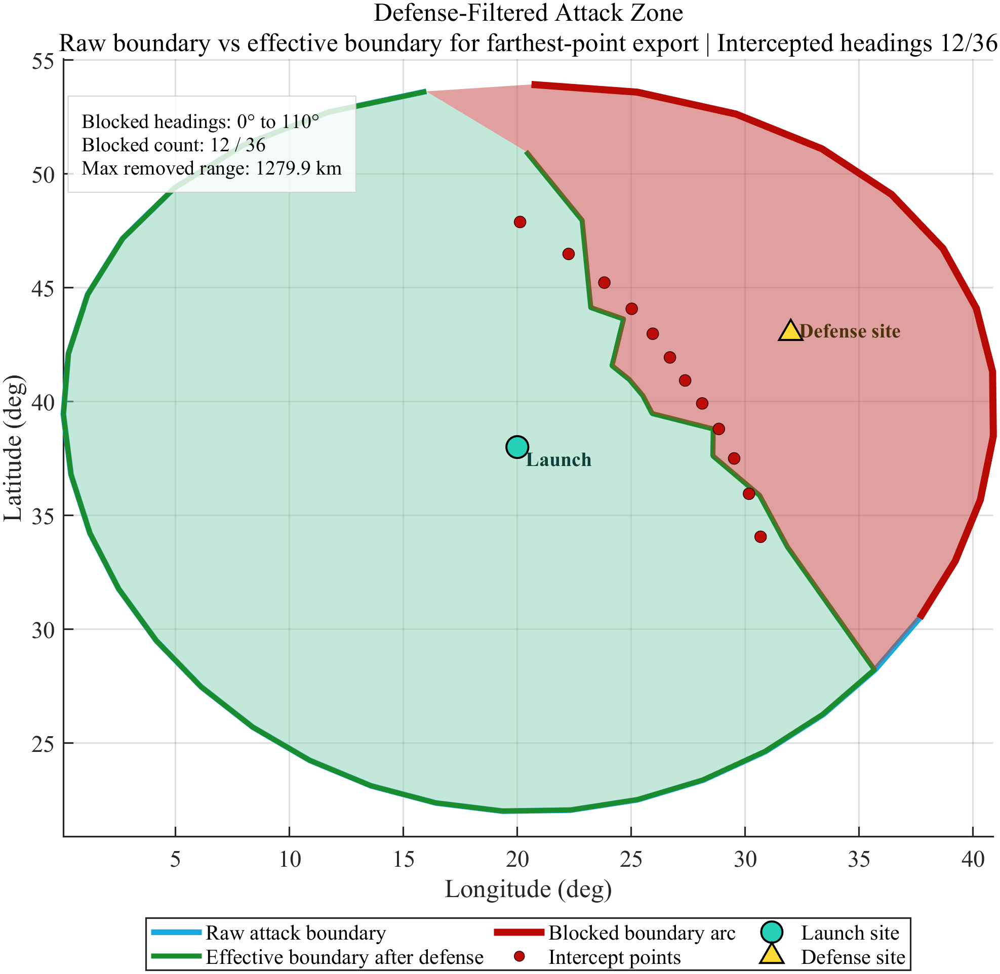
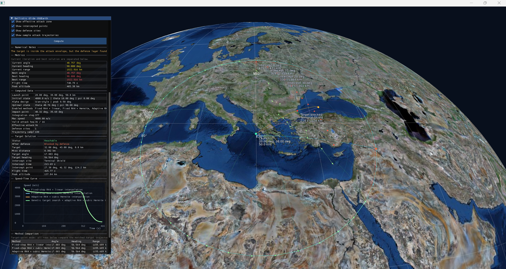
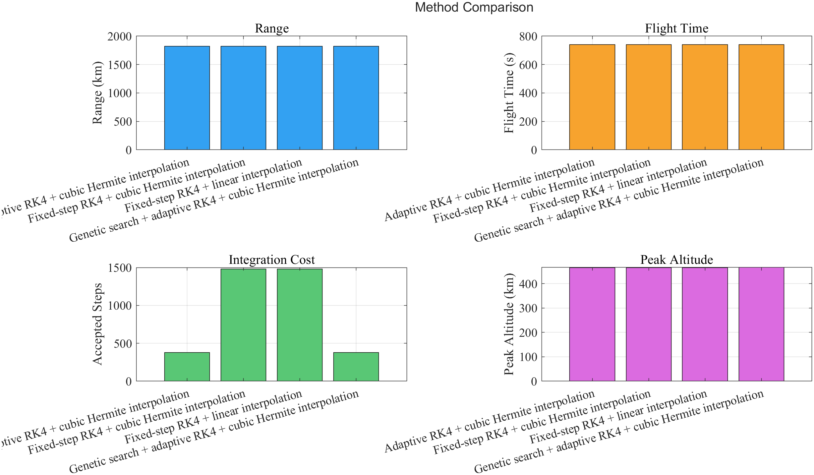
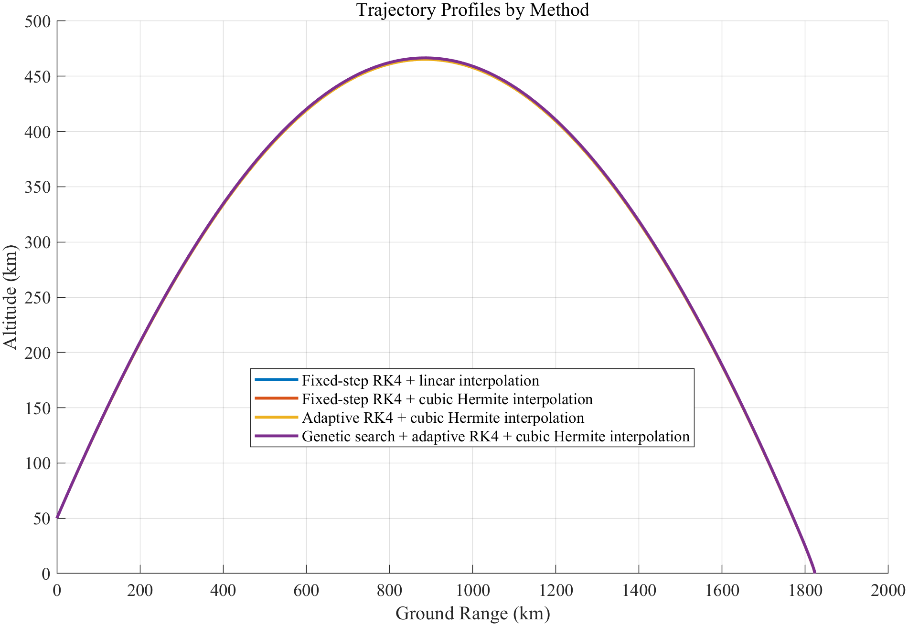

# Ballistic Trajectory Simulation

This repository contains a numerical simulation framework for ballistic trajectory analysis during the unpowered glide phase after engine cutoff. The project combines dynamic modeling, high-precision numerical integration, parameter search, and 3D Earth visualization to study maximum range, target-point matching, and defense-aware reachability.

The mathematical model considers variable Earth gravity, atmospheric density, aerodynamic drag, lift, and side force, together with Earth rotation. The solver is implemented in C++ and the visualization frontend is built with osgEarth.

## Visual Preview

The preview images below summarize the visualization layer and the exported numerical results of the system. All result figures in this README are taken from the exported MATLAB figure set produced under `case-03-defense-zone/apps/osgearth_viewer/data/exports/20260408_172923/figures_matlab`.

### 3D Earth Environment



## Result Gallery

### Maximum-Range Trajectory

The farthest-point solution reaches about 1822.8 km in downrange distance, with a peak altitude near 465 km.



### Speed-Time History

The speed history shows the expected decay along the glide trajectory and complements the trajectory-profile view.



### Ground Track

The ground-track plot shows how the trajectory projects onto the Earth surface in longitude-latitude space.



### Target-Point Matching View

This viewer snapshot shows the target-point scenario directly on the 3D globe, including the launch point, the target point, and the matched trajectory.



### Raw Attack-Zone Boundary

This figure shows the attack envelope obtained before applying defense-zone filtering.



### Defense-Filtered Attack Zone

This figure compares the raw boundary with the effective boundary after interception screening. In the exported case, 12 out of 36 headings are blocked and the removed maximum range is about 1279.9 km.



### Defense-Zone View

This 3D globe view shows the defense-site position, blocked target solution, and interception geometry in the defense-aware scenario.



### Method Comparison

The solver compares four methods:

- Fixed-step RK4 + linear interpolation
- Fixed-step RK4 + cubic Hermite interpolation
- Adaptive RK4 + cubic Hermite interpolation
- Genetic search + adaptive RK4 + cubic Hermite interpolation

The exported comparison figure highlights four metrics side by side: range, flight time, integration cost, and peak altitude.



### Trajectory Profiles By Method

The profile overlay shows that the four methods produce nearly identical farthest-point trajectories for this case, while their computational cost differs more noticeably than their geometric result.



## Repository Layout

The project is organized into three scenario-focused cases:

- `case-01-max-range`
  Baseline maximum-range analysis with free initial flight-path-angle search, trajectory export, and attack-envelope generation.
- `case-02-target-guidance`
  Target-oriented trajectory solving with heading-change control, target-point matching, and method comparison.
- `case-03-defense-zone`
  Defense-aware extension that evaluates whether a reachable trajectory can still be intercepted by a simplified defense-site model.

Each case follows nearly the same project skeleton:

- `modules/ballistics`
  Core dynamics, interpolation, search, logging, and solver logic.
- `apps/solver_cli`
  Command-line solver entry point.
- `apps/osgearth_viewer`
  3D Earth visualization frontend.
- `scripts`
  Build, run, export, and MATLAB post-processing helpers.
- `figure`
  Figures used in the written report and result presentation.

## Key Features

- Three-dimensional ballistic motion modeling in spherical Earth coordinates
- Fourth-order Runge-Kutta integration for nonlinear flight dynamics
- Fixed-step and adaptive-step numerical schemes
- Linear and cubic Hermite interpolation for impact correction and resampling
- Maximum-range search and engagement-envelope construction
- Target-point matching based on miss-distance minimization
- Defense-zone assessment with a simplified interception feasibility model
- Real-time 3D visualization on a virtual globe with exported analysis data

## Numerical Model

The implementation follows engineering simplifications for post-cutoff ballistic glide:

- Point-mass approximation for the missile body
- Earth model with radius, gravitational parameter, and rotation rate
- Atmospheric and aerodynamic effects included in the state propagation
- State variables represented by speed, flight-path angle, heading angle, radius, longitude, and latitude
- Optional target constraints and defense-zone constraints depending on the scenario

## Numerical Methods

The solver compares and combines several methods:

- Fixed-step RK4 with linear interpolation
- Fixed-step RK4 with cubic Hermite interpolation
- Adaptive-step RK4 with cubic Hermite interpolation
- Genetic-search-assisted parameter optimization for range or target matching

The output data can be used to compare trajectory shape, velocity history, peak altitude, flight time, impact point, and engagement-envelope boundary.

## Three Main Scenarios

### 1. Maximum-Range Analysis

This scenario searches for the initial condition that maximizes downrange distance after engine cutoff. It also constructs the attack boundary by solving multiple heading directions and summarizing the reachable footprint on the Earth surface.

### 2. Target-Point Matching

This scenario changes the optimization objective from maximum range to minimum miss distance. Given a target longitude, latitude, and altitude, the solver searches for the trajectory that best reaches or hits the target point.

### 3. Defense-Zone Assessment

This scenario adds a simplified defense-interception model. A trajectory may be kinematically reachable but still be classified as blocked if a defense site can intercept it within altitude, delay, range, and interceptor-speed constraints.

## Build Requirements

The project is currently Windows-oriented and was developed around:

- CMake 3.21 or newer
- Visual Studio or another CMake-supported Windows toolchain
- `vcpkg`
- `osgEarth`

## Build Configuration

The helper scripts support environment-variable overrides so the project is easier to rebuild on another machine.

- `VCPKG_ROOT`
  Root directory of a local `vcpkg` installation
- `CMAKE_GENERATOR`
  Optional generator override such as `Visual Studio 17 2022`
- `CMAKE_GENERATOR_PLATFORM`
  Optional platform override such as `x64`

If these variables are not set, the scripts fall back to a local `C:/dev/vcpkg` toolchain path when available and otherwise let CMake use its default generator selection.

## Quick Start

Build and run a case from its own folder. For example:

```powershell
cd .\case-02-target-guidance
powershell -ExecutionPolicy Bypass -File .\scripts\build_solver.ps1
powershell -ExecutionPolicy Bypass -File .\scripts\run_solver.ps1
```

To launch the osgEarth viewer:

```bat
scripts\run_osgearth.bat
```

## Outputs

Typical outputs include:

- `data/solver_output`
  Final JSON summaries and live-state output for the solver
- `apps/osgearth_viewer/data/exports`
  Exported CSV, Markdown, and figure-ready data products
- `figure`
  Static figures used in the written report

These generated artifacts are useful for experiments, but most of them should not be committed as source files.

## Report

The project report is included at [docs/report.pdf](docs/report.pdf).

Its main themes are dynamic modeling, numerical integration, range maximization, attack-envelope construction, target-point solving, and defense-aware extension of the ballistic trajectory problem.

## License

This project is distributed under the MIT License. See [LICENSE](LICENSE).
